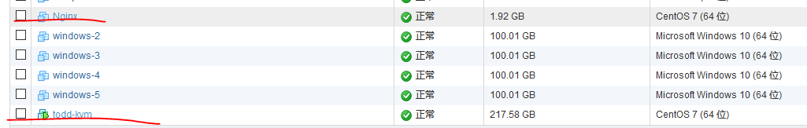
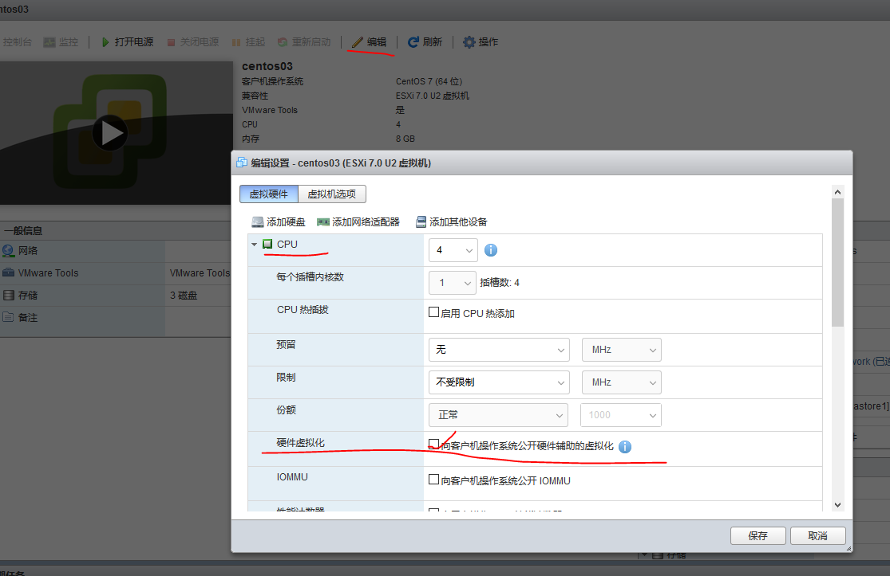
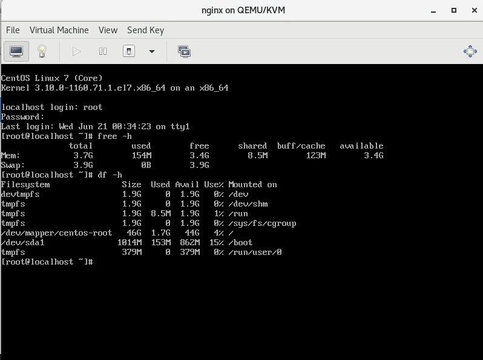

# VM ESXI虚拟机迁移到KVM

#### 资源

VM esxi 中安装一台带gui的centos7系统，用来安装kvm&#x20;

VM esxi 中导出的nginx 虚拟机一个&#x20;

<figure><figcaption></figcaption></figure>

####

#### 查看虚拟机是否支持虚拟化

```shell
#查看虚拟机是否支持虚拟化，如果输出为空，则需要进行第二步开启虚拟化
[root@lhjs ~]# cat /proc/cpuinfo | grep vmx
flags           : fpu vme de pse tsc msr pae mce cx8 apic sep mtrr pge mca cmov pat pse36 clflush dts acpi mmx fxsr sse sse2 ss ht tm pbe syscall nx pdpe1gb rdtscp lm constant_tsc arch_perfmon pebs bts rep_good nopl xtopology nonstop_tsc aperfmperf eagerfpu pni pclmulqdq dtes64 monitor ds_cpl vmx est tm2 ssse3 sdbg cx16 xtpr pdcm pcid sse4_1 sse4_2 movbe popcnt tsc_deadline_timer xsave rdrand lahf_lm abm epb invpcid_single ssbd ibrs ibpb stibp tpr_shadow vnmi flexpriority ept vpid fsgsbase tsc_adjust erms invpcid xsaveopt dtherm arat pln pts md_clear spec_ctrl intel_stibp flush_l1d
flags           : fpu vme de pse tsc msr pae mce cx8 apic sep mtrr pge mca cmov pat pse36 clflush dts acpi mmx fxsr sse sse2 ss ht tm pbe syscall nx pdpe1gb rdtscp lm constant_tsc arch_perfmon pebs bts rep_good nopl xtopology nonstop_tsc aperfmperf eagerfpu pni pclmulqdq dtes64 monitor ds_cpl vmx est tm2 ssse3 sdbg cx16 xtpr pdcm pcid sse4_1 sse4_2 movbe popcnt tsc_deadline_timer xsave rdrand lahf_lm abm epb invpcid_single ssbd ibrs ibpb stibp tpr_shadow vnmi flexpriority ept vpid fsgsbase tsc_adjust erms invpcid xsaveopt dtherm arat pln pts md_clear spec_ctrl intel_stibp flush_l1d
[root@lhjs ~]#
```

#### VM esxi开启虚拟机虚拟化

操作步骤 关闭虚拟机——选择编辑——点击cpu下拉箭头——硬件虚拟化栏打勾——保存——开机——执行查询是否支持虚拟化命令&#x20;

<figure><figcaption></figcaption></figure>

#### 关闭selinux

```shell

setenforce 0 #命令可以立即生效

永久生效，需要重启
vi /etc/sysconfig/selinux 
SELINUX=disabled
```

#### 关闭防火墙

```shell
systemctl stop firewalld
systemctl disable firewalld
```

#### 安装kvm套件

```shell
yum install qemu-kvm qemu-img virt-manager libvirt libvirt-python python-virtinst libvirt- client virt-install virt-viewer


qemu-kvm：qemu模拟器
qemu-img：qemu磁盘image管理器
virt-install：用来创建虚拟机的命令行工具
libvirt：提供libvirtd daemon来管理虚拟机和控制hypervisor
libvirt-client：提供客户端API用来访问server和提供管理虚拟机命令行工具的virsh实体
virt-viewer：图形控制台

```

#### 测试kvm

```shell
[root@localhost kvm]# stat /dev/kvm
  File: ‘/dev/kvm’
  Size: 0               Blocks: 0          IO Block: 4096   character special file
Device: 5h/5d   Inode: 18447       Links: 1     Device type: a,e8
Access: (0666/crw-rw-rw-)  Uid: (    0/    root)   Gid: (   36/     kvm)
Context: system_u:object_r:kvm_device_t:s0
Access: 2023-06-20 22:12:30.551288367 +0800
Modify: 2023-06-20 22:12:30.551288367 +0800
Change: 2023-06-20 22:12:30.551288367 +0800
 Birth: -
[root@localhost kvm]#

#使用 lsmod 命令和 grep命令 确认加载了 KVM 模块：
[root@localhost kvm]#  lsmod | grep -i kvm
kvm_intel             188793  0
kvm                   653928  1 kvm_intel
irqbypass              13503  1 kvm
[root@localhost kvm]#
```

#### 测试libvirt

```shell
[root@localhost ~]# systemctl restart libvirtd
[root@localhost ~]# systemctl enable libvirtd
```

#### 桥接网卡制作

进行桥接网卡的制作，因为系统并不会自动生成一个桥接网卡。所以必须由我们自己动手创建一个桥接虚拟的网卡。查看宿主机的网卡，将宿主机的网卡进行虚拟机桥接网卡的绑定。

```shell
#更新你的网卡配置文件
[root@localhost kvm]# vi /etc/sysconfig/network-scripts/ifcfg-ens192
TYPE=Ethernet
BRIDGE=br0
PROXY_METHOD=none
BROWSER_ONLY=no
BOOTPROTO=dhcp
DEFROUTE=yes
IPV4_FAILURE_FATAL=no
IPV6INIT=yes
IPV6_AUTOCONF=yes
IPV6_DEFROUTE=yes
IPV6_FAILURE_FATAL=no
IPV6_ADDR_GEN_MODE=stable-privacy
NAME=ens192
UUID=43e7141d-e82b-40dc-9768-121191f30b58
DEVICE=ens192
ONBOOT=yes

#床虚拟网卡br0
[root@localhost kvm]# vi /etc/sysconfig/network-scripts/ifcfg-br0
TYPE=Bridge
BOOTPROTO=dhcp
DEVICE=br0
ONBOOT=yes
DELAY=0

#重启网卡
systemctl restart network

#查看
[root@localhost kvm]# brctl show
bridge name     bridge id               STP enabled     interfaces
br0             8000.000c29e2bac3       no              ens192
virbr0          8000.525400cd9239       yes             virbr0-nic
[root@localhost kvm]#

```

#### 创建kvm虚拟机

查看vm esxi虚拟机信息

```shell
[root@localhost kvm]# qemu-img info  Nginx-1.vmdk
image: Nginx-1.vmdk
file format: vmdk
virtual size: 50G (53687091200 bytes)
disk size: 886M
cluster_size: 65536
Format specific information:
    cid: 4074881752
    parent cid: 4294967295
    create type: streamOptimized
    extents:
        [0]:
            compressed: true
            virtual size: 53687091200
            filename: Nginx-1.vmdk
            cluster size: 65536
            format:
```

转换磁盘格式

```shell
[root@localhost kvm]# ll
total 2811144
-rw-r--r--. 1 root root  929149440 Jun 20 15:20 Nginx-1.vmdk
-rw-r--r--. 1 root root         61 Jun 20 15:20 Nginx.mf
-rw-r--r--. 1 root root      15450 Jun 20 15:19 Nginx.ovf
[root@localhost kvm]# qemu-img convert -f vmdk -O qcow2 Nginx-1.vmdk nginx.qcow2


```

在KVM上安装虚拟机，本次使用命令安装，也可以打开图形化界面安装

```shell
#将镜像文件移动到指定目录
[root@localhost kvm]# mv nginx.qcow2 /var/lib/libvirt/images/

#启动虚拟机
--name #虚拟机名字
--memory #指定内存大小，4096M
--vcpus 	#指定  2个 vcpu
--disk path=		#指定镜像路径
--import		#指定启动模式导入

#执行导入命令，此处时间比较久，可以打开图形化界面查看
[root@localhost kvm]# virt-install --name nginx --memory 4096 --vcpus 2 --disk path=/var/lib/libvirt/images/nginx.qcow2,format=qcow2 --import
WARNING  No operating system detected, VM performance may suffer. Specify an OS with --os-variant for optimal results.
WARNING  Graphics requested but DISPLAY is not set. Not running virt-viewer.
WARNING  No console to launch for the guest, defaulting to --wait -1

Starting install...
Domain installation still in progress. Waiting for installation to complete.
```

查看虚拟机 在命令行输入启动命令 virt-manager&#x20;

<figure><figcaption></figcaption></figure>

&#x20;登录nginx虚拟机，使用之前的账号密码即可

<figure><figcaption></figcaption></figure>


网络
